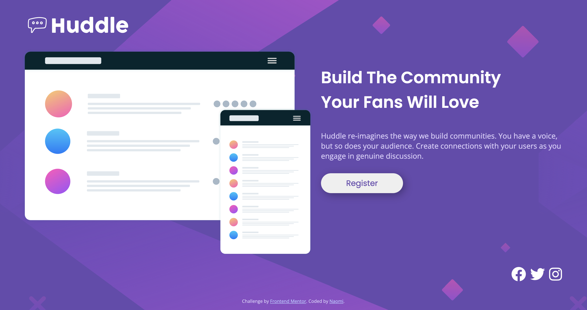

# Frontend Mentor - Huddle landing page with single introductory section solution

This is a solution to the [Huddle landing page with single introductory section challenge on Frontend Mentor](https://www.frontendmentor.io/challenges/huddle-landing-page-with-a-single-introductory-section-B_2Wvxgi0). Frontend Mentor challenges help you improve your coding skills by building realistic projects. 

## Table of contents

- [Overview](#overview)
  - [The challenge](#the-challenge)
  - [Screenshot](#screenshot)
  - [Links](#links)
- [My process](#my-process)
  - [Built with](#built-with)
  - [What I learned](#what-i-learned)
  - [Continued development](#continued-development)
  - [Useful resources](#useful-resources)
- [Author](#author)

## Overview

### The challenge

Users should be able to:

- View the optimal layout for the page depending on their device's screen size
- See hover states for all interactive elements on the page

### Screenshot

Mobile version for 375px

Desktop version for 1440px

### Links

- Solution URL: (https://github.com/naomichoe/huddle-landing.git)
<!-- - Live Site URL: (https://your-live-site-url.com) ADD live page --> 

## My process

Started with basic HTML and CSS setup. Then practiced flexbox layouts. This was slightly more challenging than the Product Preview Card project. First made sure the desktop view was set at a 1440 resolution. Then worked on the mobile layout for min-width of 375px. The layout was not porportional in between the two so added a second media query.
### Built with

- Semantic HTML5 markup
- CSS custom properties
- Flexbox
- CSS Grid
- Mobile-first workflow

### What I learned

Flexbox is getting easier to understand and set up. There are still areas of learning when trying to line up the items as I want. Also finding areas of repeat code and condensing them. Haven't gotten everything but am finding them easier and understanding why they can be condensed. 

### Continued development

I want to continue practicing flexbox and then move onto the grid layout. 

### Useful resources

- [https://www.w3schools.com/] was my main resource for this project. Also every aspect I had a question on, I was able to find the solution through here.

## Author

- Github - [@naomichoe](https://github.com/naomichoe)
- Frontend Mentor - [@naomichoe](https://www.frontendmentor.io/profile/naomichoe)

